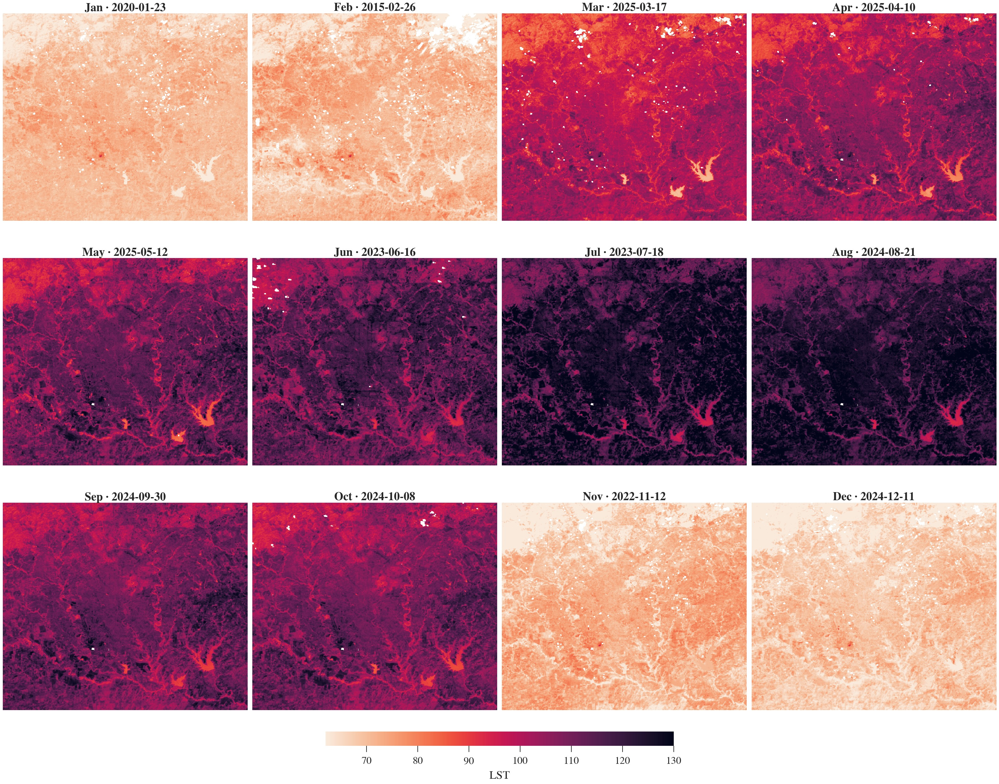
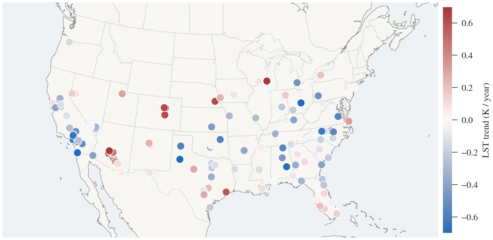
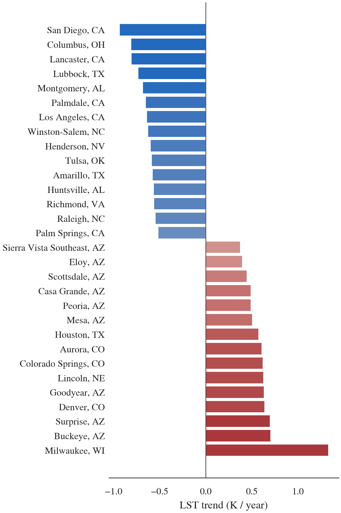

# HeatCast: A Benchmark for Neighborhood-Scale LST Forecasting across 124 U.S. Cities

[](https://opensource.org/licenses/MIT)
[](https://huggingface.co/datasets/JesseGuerreroML/HeatCast)
[](https://www.python.org/downloads/)
[](https://pytorch.org/)

<p align="center">
  <a href="https://github.com/JesseGuerrero/HeatCast">GitHub</a> &bull;
  <a href="https://huggingface.co/datasets/JesseGuerreroML/HeatCast">HuggingFace Dataset</a> &bull;
  <a href="https://jesseguerrero.github.io/HeatCast/web-app/">Visualization</a>
</p>

> **SIGSPATIAL 2026 Benchmarks Track Submission**

A large-scale open-source benchmark dataset for forecasting monthly Land Surface Temperature (LST) at 30 m spatial resolution across 124 U.S. cities, with Earthformer and CNN+LSTM baselines and an interactive web application.

---

## Overview

Land Surface Temperature (LST) serves as a critical indicator for quantifying urban heat islands and informing climate-resilient urban planning, particularly for vulnerable communities. However, the lack of open-source, large-scale, spatio-temporal datasets poses significant challenges to research at the national scale across the United States.

This repository presents:
- A **benchmark dataset** spanning 124 U.S. cities from 2013 to June 2025 (~1.4 million 128×128 tiles at 30 m resolution)
- **Earthformer and CNN+LSTM baselines** with reproducible training pipelines
- An **interactive web application** for visualizing LST predictions over San Antonio, TX

---

## Key Contributions

1. **Cross-city forecasting**: 124 cities spanning diverse climates, enabling models that generalize beyond single-city training
2. **Neighborhood-scale resolution**: 30 m spatial resolution, sufficient to distinguish thermal differences between adjacent blocks
3. **Reproducible baselines**: Open code, data, and model weights; Earthformer reaches **7.74 K aggregate RMSE**, a **~26% improvement** over CNN+LSTM (10.42 K)
4. **LST Web Application**: Integrates LST predictions into mapping software through an LLM interface for planning guidance

---

## Dataset

### Download

The dataset is available on HuggingFace: [JesseGuerreroML/HeatCast](https://huggingface.co/datasets/JesseGuerreroML/HeatCast). Each city is a self-describing Zarr v3 store that streams directly over HTTP.

```bash
huggingface-cli download JesseGuerreroML/HeatCast --repo-type dataset --local-dir ./Data/HeatCast
```

### Data Components

| Feature | Description | Resolution |
|---------|-------------|------------|
| **LST** | Land Surface Temperature | 30 m, Monthly |
| **NDVI** | Normalized Difference Vegetation Index | 30 m, Monthly |
| **NDWI** | Normalized Difference Water Index | 30 m, Monthly |
| **NDBI** | Normalized Difference Built-up Index | 30 m, Monthly |
| **Albedo** | Liang broadband albedo | 30 m, Monthly |
| **RGB** | Red, Green, Blue channels | 30 m, Monthly |
| **DEM** | Digital Elevation Model (NASADEM) | 30 m, Static |
| **LCZ** | Local Climate Zones (CONUS-wide) | 100 m, Annual |

### Dataset Statistics

| Attribute | Value |
|-----------|-------|
| Cities | 124 (CONUS) |
| Temporal Coverage | 2013 – Jun 2025 |
| Temporal Cadence | Monthly |
| Spatial Resolution | 30 m |
| Tile Size | 128 × 128 pixels (3.84 km on a side, ~14.75 km²) |
| Input Channels | 9 (LST, DEM, R, G, B, NDVI, NDWI, NDBI, Albedo) |
| Output Channel | 1 (LST) |
| Input Sequence Length | 12 months |
| Output Sequence Length | 1 month |
| Total Tiles | ~1.4 million |
| Storage Size | ~150 GB |

### Temporal Splits

| Split | Period | Months |
|-------|--------|--------|
| Training | Jan 2013 – Dec 2021 | 108 |
| Validation | Jan 2022 – Dec 2023 | 24 |
| Testing | Jan 2024 – Jun 2025 | 18 |

All 124 cities appear in every split, measuring forecasting ability under temporal distribution shift. The split is frozen and distributed with the release.

### The Forecasting Signal



*Monthly LST cycle over San Antonio, TX. For each calendar month we select the highest-coverage Landsat scene (preferring recent years, falling back when no clean scene exists), and render all twelve panels on a single colorbar. Two signals are visible at 30 m: a strong **seasonal cycle** (light colors in winter, dark heat in mid-summer).*

### Heat Trend Analysis

The benchmark ships per-city annual-mean LST histories, so the released Zarr stores support trend and attribution analysis.



*Per-city LST trend across HeatCast: the OLS slope of annual-mean LST against year (K/year), for every city with at least six years of QC-passed acquisitions. Red cities are warming, blue cities are cooling over the 2013–2025 window.*



*The fifteen most strongly cooling (blue) and fifteen most strongly warming (red) cities, ranked by their annual-mean LST slope.*

### Loading HeatCast

Load HeatCast with the released `LandsatSequenceDataset`: temporal split, 12-month input window, 1-month forecast horizon, and a `DataLoader` ready for training.

```python
from torch.utils.data import DataLoader
from dataset import LandsatSequenceDataset

train_ds = LandsatSequenceDataset(
    dataset_root="./Data/HeatCast",
    cluster="all",
    input_sequence_length=12,
    output_sequence_length=1,
    split="train",
    train_years=list(range(2013, 2022)),
    val_years=[2022, 2023],
    test_years=[2024, 2025],
    max_input_nodata_pct=0.60,
)

loader = DataLoader(train_ds, batch_size=32,
                    shuffle=True, num_workers=8,
                    pin_memory=True)

x, y = next(iter(loader))
# x: (B, 12, 9, 128, 128) -- 9 channels
# y: (B, 1, 1, 128, 128)  -- next-month LST
```

---

## Installation

### Requirements

- Python 3.8+
- PyTorch 2.0+
- CUDA 11.8+ (for GPU training)

### Setup

```bash
git clone https://github.com/JesseGuerrero/HeatCast.git
cd HeatCast

python -m venv venv
source venv/bin/activate  # Linux/Mac
# or: venv\Scripts\activate  # Windows

pip install torch pytorch-lightning rasterio numpy pandas wandb tqdm scikit-learn matplotlib earthformer
```

---

## Quick Start

### 1. Download Dataset

```bash
huggingface-cli download JesseGuerreroML/HeatCast --repo-type dataset --local-dir ./Data/HeatCast
```

### 2. Setup Data Cache

```bash
python setup_data.py \
    --dataset_root "./Data/HeatCast" \
    --cluster "all" \
    --input_length 12 \
    --output_length 1 \
    --train_years 2013 2014 2015 2016 2017 2018 2019 2020 2021 \
    --val_years 2022 2023 \
    --test_years 2024 2025
```

### 3. Train Model

```bash
python train_with_cache.py \
    --dataset_root "./Data/HeatCast" \
    --cluster "all" \
    --input_length 12 \
    --output_length 1 \
    --model_size "earthnet" \
    --batch_size 32 \
    --max_epochs 200 \
    --learning_rate 0.0001 \
    --train_years 2013 2014 2015 2016 2017 2018 2019 2020 2021 \
    --val_years 2022 2023 \
    --test_years 2024 2025 \
    --gpus 2
```

---

## Model Architectures

| Model | Description |
|-------|-------------|
| `earthnet` | Earthformer (CuboidTransformer) - recommended |
| `lstm` | CNN+LSTM baseline (DMVSTNet) |
| `tiny` / `small` / `medium` / `large` | Transformer variants at different scales |

### Training with Land Cover Clusters

```bash
# Cluster 1: Dense urban (LCZ 1-3)
python train_with_cache.py --cluster "1" --model_size "earthnet"

# Cluster 2: Suburban (LCZ 4-6)
python train_with_cache.py --cluster "2" --model_size "earthnet"

# All data
python train_with_cache.py --cluster "all" --model_size "earthnet"
```

### Channel Ablation

```bash
# RGB only (remove spectral indices, DEM, and historical LST)
python setup_data.py --remove_channels DEM ndvi ndwi ndbi albedo LST
python train_with_cache.py --remove_channels DEM ndvi ndwi ndbi albedo LST
```

---

## Benchmark Results

Test-set RMSE on the temporal split.

### Performance by LCZ Cluster

| Cluster | LCZ | Description | CNN+LSTM | Earthformer |
|---------------|-----|-------------|:--------:|:-----------:|
| All LCZs | 1-17 | All land types | 10.42 K | **7.74 K** |
| Compact urban | 1-3 | Dense buildings, sparse green space | **8.62 K** | 12.68 K |
| Open urban | 4-6 | Less dense buildings, more green space | 10.82 K | **8.41 K** |
| Other urban | 7-10 | Remaining urban classes | 8.01 K | **6.99 K** |
| Natural | 11-17 | Natural landscapes | 9.78 K | **6.58 K** |

### Feature-Set Ablation

| Input Configuration | CNN+LSTM | Earthformer |
|---------------------|:--------:|:-----------:|
| All channels (default) | 10.42 K | 7.74 K |
| LST only | 11.09 K | 8.15 K |
| Spectral (no LST) | 12.47 K | **7.72 K** |
| RGB only | 14.82 K | 8.68 K |

For Earthformer, removing historical LST and keeping only the spectral channels yields essentially the same RMSE (7.72 K vs. 7.74 K), indicating that Earthformer gains no measurable accuracy from past LST once the spectral channels are present.

---

## Web Application

The [interactive visualization](https://jesseguerrero.github.io/HeatCast/web-app/) demonstrates LST predictions for downtown San Antonio, TX using a 3D ArcGIS map with:
- Monthly LST overlay with time slider (2025-2026 predictions)
- Pre-rendered PNG map tiles at zoom levels 14-17
- Chat interface powered by an LLM for planning guidance

Run locally:
```bash
cd web-app
conda env create -f environment.yml
conda activate earthformer
python _inference_city.py   # generate tiles and temperature grids
python -m http.server 3000  # preview at http://localhost:3000
```

---

## Repository Structure

```
HeatCast/
├── dataset.py              # PyTorch dataset with interpolation and caching
├── model.py                # Earthformer and CNN+LSTM (DMVSTNet) models
├── setup_data.py           # Data preprocessing and sequence cache builder
├── train_with_cache.py     # Training script with WandB logging
├── stac_scrapper.ipynb     # Landsat STAC data collection
├── preprocess.ipynb        # Data preprocessing notebook
├── main.ipynb              # Main experiment notebook
├── CONUS_LCZ.tif           # CONUS-wide Local Climate Zone raster
├── scripts/                # Shell scripts for training and ablation
├── test/                   # Test and evaluation scripts
├── analysis/               # Dataset analysis and visualization
│   └── out/                # Distribution plots and statistics
├── web-app/                # Interactive LST visualization app
│   ├── index.html          # ArcGIS 3D map with chat interface
│   ├── _inference_city.py  # City-wide inference pipeline
│   ├── model.py            # Model loading for inference
│   └── model_baseline.ckpt # Pre-trained Earthformer checkpoint (Git LFS)
└── Data/
    └── City_Shapes/        # City boundary shapefiles
```

---

## Acknowledgements

- **Secure AI Autonomy Laboratory (SAAL)** at the University of Texas at San Antonio
- **UTSA High Performance Computing Platform**
- Data: [Landsat 8/9](https://www.usgs.gov/landsat-missions) (USGS/NASA), [CONUS LCZ](https://figshare.com/articles/dataset/CONUS-wide_LCZ_map_and_Training_Areas/11416950), [Urban Footprints](https://www.arcgis.com/home/item.html?id=9df5e769bfe8412b8de36a2e618c7672) (Esri)

## License

MIT
